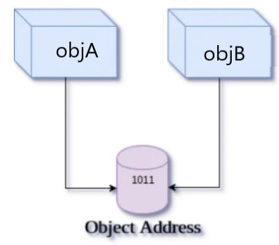
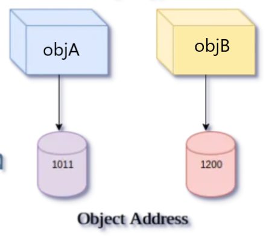

# Overview

-  **Constructor**
   -  that is responsible for creating an object
   -  get called automatically and only once
   -  same as class name
   -  Parametrized Constructor
   -  Constructor Overloading
-  **Copy Constructor**

   -  make a copy of the given object
   -  exists by default
   -  shallow copy
   -  When you need to define your own copy constructor?

      -  You have to make your own copy constructor if a deep copy is needed.

-  **Copy Assignment Operator**

   -  Copies when you do Assignment

   ```cpp

   Car d=c; //Copy Constructor

   Car d;
   d=c; //Copy Assignment operator.

   ```

   -  you can write your own copy assignment operator to make a deep copy.

# Copy Constructor

Copy Constructors is a type of constructor which is used to create a copy of an
already existing object of a class type.

> Syntax of Copy Constructor

```cpp
Classname(const classname &objectname)
{
    . . . .
}
```

> ex:

```cpp
class Point
{
private:
    int x, y;
public:
    Point(int x1, int y1) { x = x1; y = y1; }
    // Copy constructor
    Point(const Point &p1) {x = p1.x; y = p1.y; }

};

int main()
{
    Point p1(10, 15); // Normal constructor is called here
    Point p2 = p1; // Copy constructor is called here

    return 0;
}

```

## When is copy constructor called?

---

In C++, a Copy Constructor may be called in the following cases:

-  When an object is returned by value.
-  When an object is passed (to a function) by value as an argument.
-  When an object is constructed based on another object of the same class.
-  When the compiler generates a temporary object.

It is, however, not guaranteed that a copy constructor will be called in all
these cases, because the C++ Standard allows the compiler to optimize the copy
away in certain cases

# Shallow Copy vs Deep Copy

## Shallow copy

---

A shallow copy of an object copies all of the member field values. This works
well if the fields are values, but may not be what you want for fields that
point to dynamically allocated memory. The pointer will be copied. but the
memory it points to will not be copied – the field in both the original object
and the copy will then point to the same dynamically allocated memory, which is
not usually what you want.\
**The default copy constructor and assignment operator make shallow copies**.

> Shallow Copy



Shallow copy constructor is used when class is not dealing with any dynamically
allocated memory.

## Deep Copy

---

The compiler created copy constructor works fine in general. We need to define
our own copy constructor only if an object has pointers or any runtime
allocation of the resource like filehandle, a network connection..etc.

A deep copy copies all fields, and makes copies of dynamically allocated memory
pointed to by the fields. To make a deep copy, you must write a copy constructor
and overload the assignment operator, otherwise the copy will point to the
original, with disasterous consequences.

Deep copy allocates separate memory for copied information. So the source and
copy are different. Any changes made in one memory location will not affect copy
in the other location. When we allocate dynamic memory using pointers we need
user defined copy constructor. Both objects will point to different memory
locations.

> Deep Copy



**Deep copy is possible only with user defined copy constructor.** In user
defined copy constructor, we make sure that pointers (or references) of copied
object point to new memory locations.

General requirements for deep copy:

-  A normal constructor.
-  A destructor to delete the dynamically allocated memory.
-  A copy constructor to make a copy of the dynamically allocated memory. An
   overloaded assignment operator.
